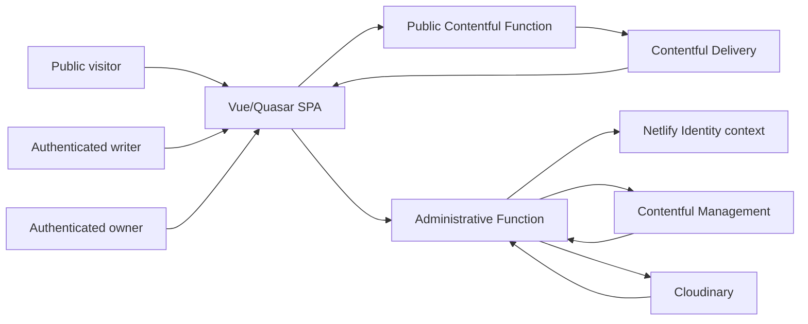

# Application Security Threat Model

## Overview

The repository contains a public Vue/Quasar single-page site and Netlify Functions that read public Contentful content. It also contains authenticated administrative workflows for author profiles, article drafts, editorial review, publication lifecycle operations, tag management, and Cloudinary media operations. The browser is an untrusted client; privileged authorization is expected to be enforced by the administrative Function before any management or media mutation.

| Component or workflow | Boundary and security-relevant responsibility | Evidence |
| --- | --- | --- |
| Public SPA | Renders home, about, blog, article, tag, and author routes; consumes public proxy data | `app/src/router/routes.js:3-32`, `app/netlify/functions/contentful.js:1-14` |
| Administrative SPA | Presents owner/writer workflows and sends Identity-backed requests; route metadata is not authorization | `app/src/router/routes.js:34-77`, `app/src/utils/adminApi.js:16-43` |
| Public Contentful Function | Normalizes public route/query input, calls Contentful Delivery, and returns bounded public payloads | `app/netlify/functions/contentfulProxyCore.js:17-35`, `app/netlify/functions/contentfulProxyCore.js:428-445` |
| Administrative Contentful Function | Derives the Netlify Identity session, checks role/ownership, validates lifecycle state/version, and calls Contentful Management or Cloudinary facades | `app/netlify/functions/contentfulAdminCore.js:47-90`, `app/netlify/functions/contentfulAdminCore.js:1306-1322` |
| Local middleware | Runs development proxy routes and loopback CORS policy; developer preview role headers are development-only | `app/middleware/server.js:1-32`, `app/middleware/corsPolicy.js:1-18` |
| Deployment policy | Defines redirects and browser security headers; secret values remain deployment-managed | `app/netlify.toml:1-29` |

### Effective resources

| Deployment or workflow | Resource or capability | Configuration and precedence | Safe effective value or location | Readers, writers, or recipients | Enforcing control | Evidence or unknowns |
| --- | --- | --- | --- | --- | --- | --- |
| Production public read | Contentful Delivery API | Function runtime configuration is consumed server-side | Fixed Contentful Delivery host and server-side credential reference | Public Function only; normalized public payload to browser | Fixed host, bounded query normalization, safe error response | `app/netlify/functions/contentfulProxyCore.js:289-310`, `app/netlify/functions/contentfulProxyCore.js:428-445` |
| Production administrative mutation | Contentful Management API | Function runtime configuration is consumed server-side | Fixed Contentful Management host and server-side credential references | Administrative Function only; safe public error to browser | Identity session, role/ownership checks, version and lifecycle validation | `app/netlify/functions/contentfulAdminCore.js:1020-1078`, `app/netlify/functions/contentfulAdminCore.js:1306-1322`; deployment token scope remains an operational question |
| Production media workflow | Cloudinary API/editor | Function runtime configuration and public editor configuration are separate | Fixed Cloudinary API host; browser receives only explicitly public editor configuration | Administrative Function and approved browser editor | Authenticated admin routes and media facade boundary | `app/netlify/functions/contentfulAdminCore.js:1040-1198`; upload limits and provider policy require review |
| Production browser policy | CSP and related response headers | Netlify headers apply to `/*` | Header policy in `app/netlify.toml` | Browser enforces policy for all public/admin routes | CSP, HSTS, MIME, frame, and referrer headers | `app/netlify.toml:1-9`; least-privilege compatibility remains a review item |
| Local development preview | Preview identity role | `NODE_ENV=development` gates a non-production header | Synthetic writer/owner session only in local development | Local middleware and local tests | Environment check plus exact role allowlist | `app/netlify/functions/contentfulAdminCore.js:73-90`; local startup configuration is intentionally not recorded here |

## Threat Model, Trust Boundaries, and Assumptions

### Protected assets and objectives

- Integrity of Contentful articles, author profiles, tags, editorial requests, publication state, versions, and archives.
- Confidentiality of management credentials, delivery credentials, Cloudinary write credentials, Identity claims, private identifiers, and server diagnostics.
- Correct ownership and role separation between writers and owners.
- Browser safety when CMS, Markdown, URLs, media metadata, and Identity display data reach rendering or navigation sinks.
- Availability and cost bounds for public proxies, authenticated mutations, uploads, and third-party API calls.

### Actors and starting capabilities

- Public visitor controls route parameters, query strings, request timing, browser state, and public CMS content returned by the delivery path, but has no administrative Identity session.
- Authenticated writer controls their browser and their own submitted article/profile data, but must not gain owner-only lifecycle or tag-management authority.
- Authenticated owner controls an authorized Identity session and owner workflows, but does not control server configuration or provider credentials.
- Contentful, Cloudinary, and Netlify Identity are external service authorities whose responses and availability are not fully controlled by the application.
- A local developer may use the development-only preview role header; this capability must not be accepted in production.

### Trust boundaries and invariants

1. Browser to public Function: route/query data is attacker-controlled and must be normalized, bounded, and returned as safe public data.
2. Browser to administrative Function: bearer/session evidence is untrusted until the server derives and authorizes the Identity context; frontend visibility and `requiresAdmin` metadata are not authorization.
3. Administrative Function to Contentful Management/Cloudinary: only server-side credentials and validated, authorized operations may cross this boundary.
4. CMS/Markdown/upstream data to browser DOM: rendering and navigation must constrain executable markup, unsafe URLs, and active content.
5. Deployment configuration to runtime: credential references and policy settings must remain server-side, least-privilege, and free of public diagnostics.

## Attack Surface, Mitigations, and Attacker Stories

The following are hypotheses and review priorities, not validated findings.

| Priority | Scenario and capability gain | Prerequisites | Impact | Existing controls | Mitigation | Evidence |
| --- | --- | --- | --- | --- | --- | --- |
| Critical | Forged or insufficient Identity evidence reaches a management mutation and gains unauthorized content integrity | Function context or authorization path misconfigured | Unauthorized publish, delete, or profile mutation | Session derivation and role helpers exist | Trace every admin route and fail closed before upstream calls | `app/netlify/functions/contentfulAdminCore.js:47-71`, `app/netlify/functions/contentful-admin.js:1-24` |
| High | Writer-controlled article/tag identifiers bypass ownership or lifecycle checks | Crafted request body/path and a missing server-side invariant | Cross-author edits, deletion, or publication | Version and ownership validation exists for editorial operations | Validate every operation source-to-sink and add route-specific regression tests | `app/netlify/functions/contentfulAdminCore.js:1306-1322`, `app/netlify/functions/contentfulAdminCore.js:1471-1493` |
| High | Markdown, CMS fields, identity data, or media URLs become executable or unsafe browser content | Attacker-controlled or compromised upstream content reaches a DOM/navigation sink | Stored XSS, phishing navigation, or policy bypass | Some content handling and CSP exist | Review every renderer, URL builder, and browser policy with malicious fixtures | `app/src/components/BlogArticle.vue:304-311`, `app/src/pages/AdminProfile.vue:56-56`, `app/netlify.toml:4` |
| High | Server diagnostics or credentials are returned to a browser or published artifact | Error path, bundle, log, or build configuration exposes sensitive values | Credential theft or internal reconnaissance | Public error classes and build credential tests exist | Scan outputs without reading secret files; enforce stable safe errors | `app/netlify/functions/contentfulAdminCore.js:110-119`, `app/netlify/functions/contentfulProxyCore.js:431-443` |
| Medium | Unbounded queries, uploads, retries, or provider calls exhaust resources | Repeated public/admin requests or oversized input | Availability, cost, or provider throttling impact | Several query and retry bounds exist | Inventory all limits and add deterministic abuse controls | `app/netlify/functions/contentfulProxyCore.js:1-6`, `app/netlify/functions/contentfulAdminCore.js:1203-1209` |
| Medium | Replayed or stale lifecycle mutation overwrites newer state or repeats destruction | Repeated request, stale version, or race | Data loss or inconsistent editorial state | Version headers and conflict errors exist | Verify every mutation's idempotency, version, and replay behavior | `app/netlify/functions/contentfulAdminCore.js:101-107`, `app/netlify/functions/contentfulAdminCore.js:1310-1320` |

## Severity Calibration

- **Critical:** remotely reachable unauthorized administrative control over multiple protected assets or server-side credential compromise, with no effective privilege boundary. A merely hidden route or an attacker who already owns the required account is not sufficient.
- **High:** reachable cross-author mutation, stored XSS affecting privileged users, credential/Identity disclosure, or destructive operation bypass with meaningful integrity or confidentiality impact.
- **Medium:** bounded but material abuse, a single-scope authorization gap with compensating controls, or policy weakness requiring additional deployment or content prerequisites.
- **Low:** defense-in-depth weakness with no demonstrated new attacker capability, cosmetic policy gap, or unsupported scanner-only report. It remains trackable when it improves a stated invariant.

Impact, confidence, reachability, and missing deployment evidence remain separate. No scenario above is a confirmed vulnerability until source-to-sink validation completes.

Repository: marcelo-munhoz
Version: issue_49@6ceb845
